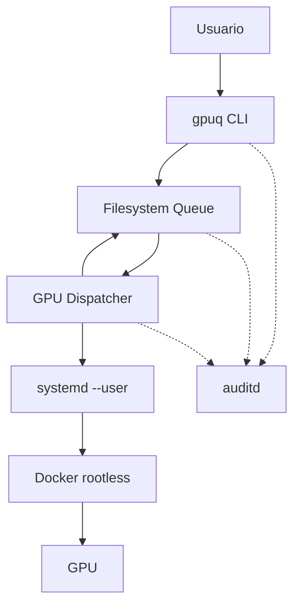
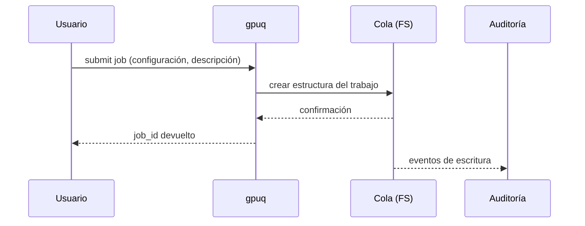
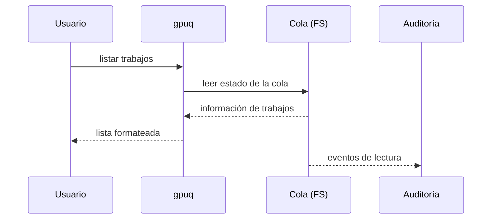
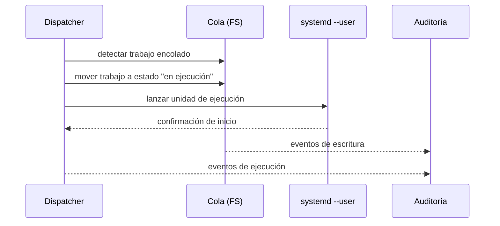
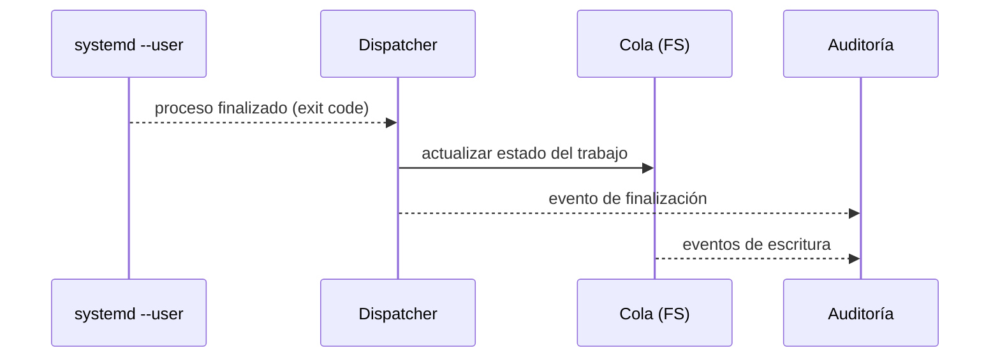
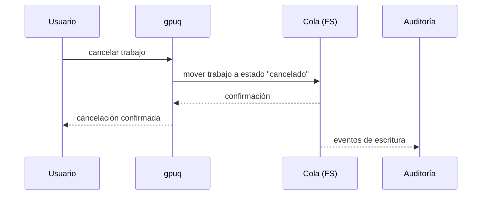
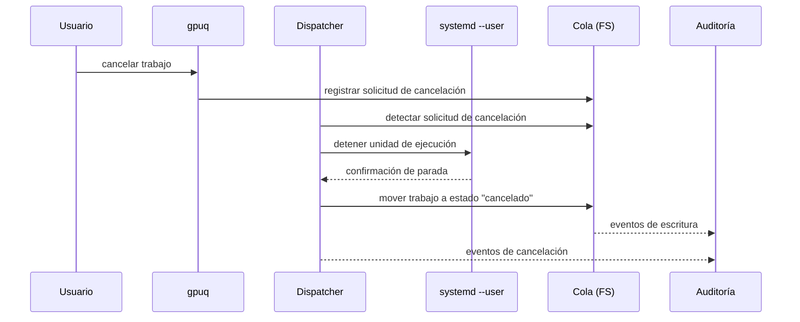

# Arquitectura del sistema

## 1. Visión general de los componentes

Los componentes que conforman el sistema son los siguientes:

- Interfaz de línea de comandos (`gpuq`)
- Cola de trabajos basada en sistema de ficheros
- Dispatcher de trabajos GPU
- Entorno de ejecución de usuario (`systemd --user`)
- Motor de ejecución de contenedores (Docker rootless)
- Sistema de auditoría (`auditd`)

El siguiente diagrama representa los componentes del sistema y sus relaciones principales:

---

## 2. Interfaz de línea de comandos (`gpuq`)
### 2.1 Responsabilidad

La herramienta gpuq constituye el único punto de entrada para que los usuarios interactúen con el sistema.

Su responsabilidad es gestionar la intención del usuario, no ejecutar cargas de trabajo.

### 2.2 Funciones principales

- Encolar nuevos trabajos GPU.
- Consultar el estado de la cola de trabajos.
- Solicitar la cancelación de trabajos propios.

### 2.3 Restricciones técnicas

- No ejecuta cargas de trabajo.
- No interactúa directamente con la GPU.
- No invoca Docker.
- No requiere privilegios de superusuario.
- No mantiene estado interno persistente.

### 2.4 Interacciones

- Escribe metadatos de trabajos en la cola del sistema de ficheros (sección 3).
- Lee el estado de los trabajos desde la cola (sección 3).
- No interactúa directamente con el dispatcher (sección 4).

---

## 3. Cola de trabajos basada en sistema de ficheros
### 3.1 Responsabilidad

La cola de trabajos es el mecanismo central de persistencia del sistema y constituye la fuente de verdad del estado de los trabajos.

### 3.2 Estructura y metadatos de un trabajo

Cada trabajo encolado deberá representarse mediante una estructura de directorio que contenga la información necesaria para su identificación, ejecución y seguimiento.

La información asociada a cada trabajo se divide en dos categorías: metadatos obligatorios y metadatos operativos.

#### 3.2.1 Identificación del trabajo

Cada trabajo deberá disponer de:

- Identificador único (`job_id`), generado en el momento del encolado.
- Usuario propietario (`username`).
- Marca temporal de creación (`created_at`).

El identificador único deberá ser suficiente para evitar colisiones en condiciones normales de operación.

#### 3.2.2 Información de ejecución

Cada trabajo deberá almacenar la información necesaria para su ejecución:

- Ruta del proyecto o directorio de trabajo.
- Fichero de configuración principal (por ejemplo, docker compose).
- Parámetros adicionales de ejecución (si aplica).
- Entorno requerido (opcional, según implementación futura).

Esta información deberá almacenarse de forma estructurada y legible.

#### 3.2.3 Información descriptiva

Cada trabajo podrá incluir un campo opcional de descripción (`description`).

Este campo tendrá como finalidad:

- Facilitar la identificación del trabajo en consultas de estado.
- Permitir a los usuarios distinguir entre experimentos similares.
- Mejorar la usabilidad del sistema sin afectar a la lógica de ejecución.

La descripción no deberá afectar al comportamiento del sistema ni influir en la planificación.

#### 3.2.4 Estado del trabajo

El estado del trabajo no se almacenará como un campo editable, sino que se inferirá exclusivamente a partir de su ubicación dentro de la estructura de la cola.

Estados previstos:

- encolado
- en ejecución
- finalizado correctamente
- finalizado con error
- cancelado

#### 3.2.5 Información de resultado

Tras la ejecución, el sistema podrá registrar:

- Marca temporal de inicio (`started_at`)
- Marca temporal de finalización (`finished_at`)
- Código de salida del proceso
- Información resumida del resultado (si aplica)

Esta información tendrá carácter informativo y no modificará retroactivamente la lógica del sistema.

### 3.3 Propiedades

- Persistente ante reinicios del sistema.
- Visible y auditable mediante herramientas estándar.
- No requiere servicios externos.
- Basada en operaciones atómicas del sistema de ficheros.

### 3.4 Restricciones

- No ejecuta lógica.
- No aplica políticas.
- No valida semántica de trabajos.

### 3.5 Interacciones

- Recibe operaciones de escritura y lectura desde la herramienta `gpuq` para la creación y consulta de trabajos (sección 2).
- Es monitorizada de forma continua por el dispatcher para detectar nuevos trabajos y cambios de estado.
- No inicia interacciones activas con otros componentes (sección 4).
- Todas las transiciones de estado se realizan mediante operaciones del sistema de ficheros.
- Sus operaciones pueden ser observadas por el sistema de auditoría (sección 7).

---

## 4. Dispatcher de trabajos GPU
### 4.1 Responsabilidad

El dispatcher es el componente coordinador del sistema.

Su función es garantizar la ejecución secuencial de los trabajos GPU y la correcta transición de estados dentro de la cola.

### 4.2 Funciones principales

- Monitorizar la cola de trabajos.
- Seleccionar el siguiente trabajo elegible.
- Garantizar exclusión mutua en el acceso a la GPU.
- Lanzar la ejecución del trabajo.
- Actualizar el estado del trabajo tras su ejecución.

### 4.3 Características operativas

- Se ejecuta como servicio del sistema.
- Posee privilegios controlados y limitados.
- No ejecuta directamente código de usuario en su propio contexto.
- No contiene lógica específica de las cargas de trabajo.

### 4.4 Gestión de errores

- Detecta estados inconsistentes en la cola.
- Aplica acciones correctivas razonables (reencolado, marcado como fallido).
- No elimina trabajos sin dejar trazabilidad.

### 4.5 Interacciones

- Lee el estado de los trabajos desde la cola basada en sistema de ficheros (sección 3).
- Modifica el estado de los trabajos mediante operaciones atómicas sobre el sistema de ficheros (sección 3).
- Invoca el entorno de ejecución `systemd --user` para lanzar trabajos bajo la identidad del usuario correspondiente (sección 5).
- Gestiona el acceso exclusivo a la GPU mediante un mecanismo de exclusión mutua.
- Genera eventos observables por el sistema de auditoría (sección 7).

---

## 5. Entorno de ejecución de usuario (`systemd --user`)
### 5.1 Responsabilidad

Proporcionar un entorno de ejecución persistente y desacoplado de la sesión interactiva del usuario.

### 5.2 Funciones

- Ejecutar trabajos aunque el usuario no tenga sesión activa.
- Gestionar el ciclo de vida del proceso del trabajo.
- Integrarse con el sistema de logging del sistema operativo.

### 5.3 Interacciones

- Invocado por el dispatcher (sección 4).
- Ejecuta procesos bajo la identidad real del usuario.

---

## 6. Ejecución de contenedores (Docker rootless)
### 6.1 Responsabilidad

Ejecutar la carga de trabajo real del usuario dentro de un contenedor aislado.

### 6.2 Características

- Docker se ejecuta en modo rootless.
- Los contenedores heredan UID y GID del usuario.
- Los ficheros generados mantienen propiedad correcta.

### 6.3 Alcance

Docker no participa en la gestión de la cola ni en la planificación del sistema.

### 6.4 Interacciones

- Es invocado desde el entorno `systemd --user` para ejecutar la carga de trabajo del usuario (sección 5).
- Accede a la GPU durante la ejecución del trabajo, bajo el control del dispatcher (sección 4).
- Interactúa con el sistema de ficheros del usuario para leer y escribir datos de entrada y salida (sección 3).
- No tiene conocimiento de la cola ni del estado global del sistema.

---

## 7. Sistema de auditoría (`auditd`)
### 7.1 Responsabilidad

Proporcionar trazabilidad completa de las acciones realizadas sobre la cola y los trabajos.

### 7.2 Características

- Basado en mecanismos de auditoría del sistema operativo.
- Registra acciones manuales y automáticas.
- Independiente de la lógica interna de la aplicación.

### 7.3 Uso previsto

- Análisis forense.
- Depuración de incidencias.
- Verificación de cumplimiento operativo.

### 7.4 Interacciones

- Observa las operaciones realizadas sobre el sistema de ficheros asociadas a la cola de trabajos (sección 3).
- Registra las acciones realizadas por `gpuq`, el dispatcher y otros procesos del sistema (sección 2).
- No modifica el comportamiento de los componentes auditados.
- Proporciona información para análisis posterior sin intervenir en la ejecución del sistema.

---

## 8. Interacciones con el sistema
### 8.1 Encolado de un trabajo

Un usuario solicita la ejecución de un nuevo trabajo GPU mediante la interfaz de línea de comandos `gpuq`.

El sistema deberá registrar el trabajo en la cola persistente sin iniciar su ejecución inmediata.

### 8.2 Consulta del estado de la cola

Un usuario consulta el estado de la cola para conocer los trabajos existentes y su estado actual. La consulta no modifica el estado del sistema.

### 8.3 Inicio de ejecución de un trabajo

El dispatcher detecta la existencia de un trabajo encolado y decide iniciar su ejecución, garantizando el acceso exclusivo a la GPU.

### 8.4 Finalización de un trabajo

Una vez finalizada la ejecución, el sistema actualiza el estado del trabajo y libera el acceso a la GPU.

### 8.5 Cancelación de un trabajo encolado

Un usuario solicita la cancelación de un trabajo que se encuentra en estado encolado.

La cancelación no implica la detención de ningún proceso en ejecución, sino únicamente la retirada del trabajo de la cola antes de que sea seleccionado por el dispatcher.

### 8.6 Cancelación de un trabajo en ejecución

Un usuario solicita la cancelación de un trabajo que se encuentra actualmente en ejecución.

El sistema deberá detener la ejecución del trabajo de forma controlada y actualizar su estado de manera consistente.

