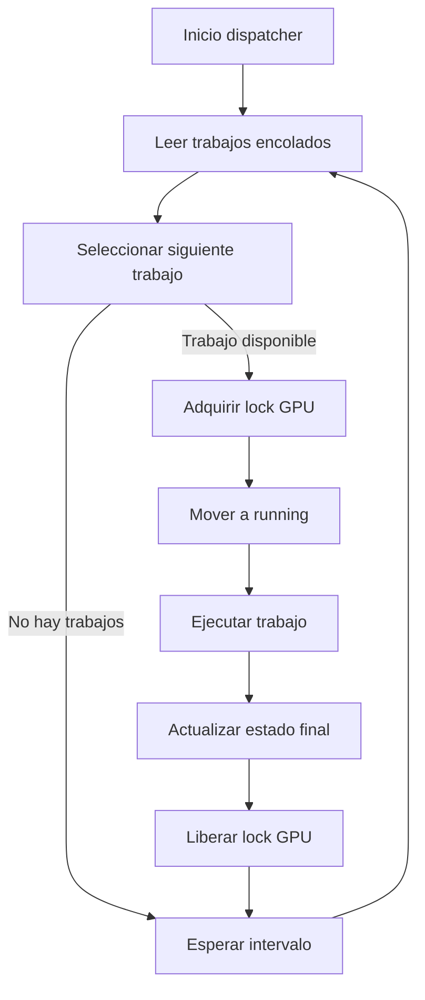

# Manual del desarrollador

## 1. Estructura del repositorio

El repositorio se organiza en dos componentes principales, diseñados para ser
independientes entre sí:

```text
gpuq/
├── gpuq_cli/
│   ├── cli.py
│   ├── gpuq.py
│   ├── jobs.py
│   ├── queue.py
│   ├── utils.py
│   └── errors.py
│
├── gpuq_dispatcher/
│   ├── dispatcher.py
│   ├── scheduler.py
│   ├── executor.py
│   ├── queue.py
│   ├── jobs.py
│   ├── gpu_lock.py
│   ├── config.py
│   ├── utils.py
│   └── errors.py
│
├── tests/
│   ├── test_cli_*.py
│   ├── test_dispatcher_*.py
│
└── docs/
```

### Decisión de diseño clave

No existe un paquete compartido (core) entre CLI y dispatcher. La única interfaz entre ambos componentes es la cola persistente basada en sistema de ficheros, lo que evita acoplamientos implícitos y facilita la auditoría.

---

## 2. Separación conceptual de responsabilidades
### 2.1 `gpuq_cli`

Responsabilidades:

- Interacción con el usuario
- Validación estricta de los trabajos
- Creación y modificación de entradas en la cola
- Consulta del estado de los trabajos

El CLI no ejecuta cargas de trabajo, no interactúa con la GPU y no
contiene lógica de planificación.

### 2.2 `gpuq_dispatcher`

Responsabilidades:

- Monitorizar la cola
- Seleccionar el siguiente trabajo a ejecutar
- Garantizar exclusión mutua sobre la GPU
- Ejecutar trabajos
- Actualizar el estado de los trabajos

El dispatcher no acepta entrada directa de usuarios.

---

## 3. Contrato de la cola basada en sistema de ficheros

No existe estado persistente fuera de la cola.

### 3.1 Representación del estado

El estado de un trabajo se infiere exclusivamente por su ubicación:

```text
queue/
├── queued/
├── running/
├── finished/
├── failed/
└── canceled/
```

### 3.2 Transiciones

Las transiciones de estado se implementan mediante operaciones atómicas del
sistema de ficheros (rename / move).

Cualquier modificación futura debe preservar esta propiedad.

---

## 4. Esquema YAML de los trabajos

Cada trabajo se representa mediante un fichero YAML almacenado en la cola.

### 4.1 Esquema lógico

```yaml
user: <string>                # Usuario propietario del trabajo (obligatorio)
project_path: <string>        # Ruta absoluta al directorio del proyecto
compose_file: <string>        # Fichero docker compose a ejecutar
created_at: <ISO8601 string>  # Marca temporal de creación
description: <string>         # Descripción opcional del trabajo
started_at: <ISO8601 string>  # Marca temporal de inicio (opcional)
finished_at: <ISO8601 string> # Marca temporal de finalización (opcional)
```

### 4.2 Reglas importantes

- `job_id` no forma parte del YAML. Se infiere a partir del nombre del fichero.
- `started_at` y `finished_at` son gestionados por el sistema.

---

## 5. Estrategia de planificación
### 5.1 Patrón de diseño

La política de planificación está encapsulada en scheduler.py, siguiendo un
patrón de estrategia.

```python
class Scheduler:
    def select_next_job(self, jobs):
        ...
```

### 5.2 Política actual: FIFO

- Ordenación por created_at
- Selección del trabajo más antiguo
- Comportamiento determinista

No existen prioridades ni preempción en la versión actual.

### 5.3 Extensiones futuras

Las nuevas políticas deberán:
- No acceder directamente al sistema de ficheros
- No modificar el estado de los trabajos
- Permanecer desacopladas del dispatcher

---

## 6. Mecanismo de exclusión de GPU

La exclusión mutua se implementa mediante un lock basado en sistema de
ficheros (`gpu_lock.py`).

### 6.1 Uso del patrón context manager

El lock implementa `__enter__` y `__exit__`:

```python
with GPULock():
    ejecutar_trabajo()
```

Esto garantiza:

- Liberación automática del lock
- Seguridad ante excepciones
- Semántica clara de región crítica

Este patrón debe preservarse en cualquier ampliación.

## 7. Ciclo de vida del dispatcher

El dispatcher sigue un bucle de control simple y determinista.

### 7.1 Flujo general


### 7.2 Parada controlada

Ante señales de terminación:

- No se inician nuevos trabajos
- El trabajo en ejecución puede finalizar
- El estado de la cola permanece consistente

## 8. Variables de entorno y configuración
### 8.1 Variables del CLI (`gpuq_cli`)
| Variable          | Valor por defecto | Descripción                                                                                                     |
| ----------------- | ----------------- | --------------------------------------------------------------------------------------------------------------- |
| `GPUQ_QUEUE_ROOT` | `./queue`         | Ruta raíz de la cola en sistema de ficheros. Debe ser accesible por todos los usuarios que utilicen el sistema. |


### 8.2 Variables del dispatcher (`gpuq_dispatcher`)
| Variable              | Valor por defecto     | Descripción                                                                                |
| --------------------- | --------------------- | ------------------------------------------------------------------------------------------ |
| `QUEUE_ROOT`          | `/var/lib/gpuq/queue` | Ruta raíz de la cola gestionada por el dispatcher. Debe coincidir con la usada por el CLI. |
| `POLL_INTERVAL`       | `5`                   | Intervalo (en segundos) entre iteraciones del bucle del dispatcher.                        |
| `SYSTEMD_UNIT_PREFIX` | `gpuq-job`            | Prefijo utilizado para nombrar las unidades `systemd --user` creadas dinámicamente.        |

